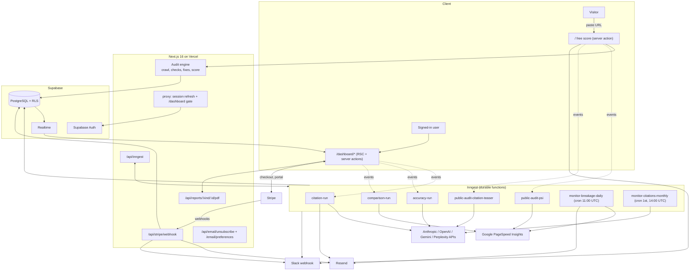
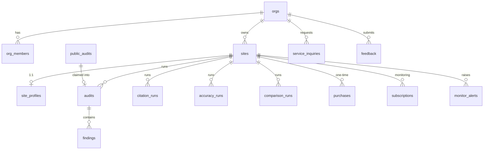

# Scale Visibility — architecture notes

These notes describe the real system as of September 2026 and are derived from the private codebase. Nothing here is aspirational. The companion marketing site at `www.scalevisibility.com` (with its six free single-purpose tools) is a separate Astro project and is out of scope here.

## 1. System overview

**Execution model.** The deterministic audit runs synchronously inside server actions (public intake, dashboard "run audit", and the full workup). Everything that touches an LLM, PageSpeed Insights or multiple domains runs in Inngest. Long-running routes set a 60-second function limit.

## 2. Data model

PostgreSQL on Supabase. Hand-written SQL migrations are the source of truth; a Drizzle schema mirrors them for types. All runtime reads and writes go through the Supabase client, either as the signed-in user under row-level security or through a server-only service-role client. Enum-like columns are text with CHECK constraints.

| Table | Purpose |
|---|---|
| `orgs`, `org_members` | Workspace (tenant) and membership with `owner` / `member` roles. A database trigger creates a personal workspace for every new auth user. An operator flag on the org bypasses paid gates for dogfooding. |
| `sites` | A domain inside a workspace. |
| `site_profiles` | One per site: business name, city, local or national scope, industry bucket and service term, competitors, aliases, plus ground-truth facts (hours, address, phone, services) for the accuracy check. |
| `audits`, `findings` | Deterministic audit runs with the full report as JSON, score and counts, PageSpeed results, and one row per finding for interactive views. A partial unique index makes claiming a public audit into a workspace idempotent. |
| `citation_runs`, `accuracy_runs`, `comparison_runs` | Background run rows with `queued` → `running` → `done` / `error` status, JSON results, and estimated cost. All three are in the Realtime publication so live pages update on row changes. |
| `public_audits` | Anonymous front-door runs. RLS is enabled with no policies, so only the service role can read or write. Stores the report, PageSpeed status, the citation teaser, a salted IP hash for rate limiting, and claim pointers. |
| `purchases` | One-time audit purchases keyed by Stripe checkout session, with `pending` / `paid` / `refunded` / `canceled` status. |
| `subscriptions` | Per-site monitoring subscriptions mirrored from Stripe, with a partial unique index allowing one live subscription per site, an alert-email preference and an unsubscribe token. |
| `monitor_alerts` | Alert ledger keyed by site and fingerprint, with a partial unique index allowing one open alert per fingerprint, plus opened, resolved, notified and resolution-notified timestamps. |
| `service_inquiries`, `feedback` | Done-for-you quote requests and in-app feedback. |

Every tenant table carries `org_id` with a cascading foreign key. Tenant tables use a policy of the form "org id is in the caller's workspaces", evaluated through a security-definer function; billing and alert tables are read-only for members and written only by the service role.

## 3. Audit engine

1. **Normalize** the input to an origin and reject non-public hostnames (localhost, `.local` and `.internal`, private, loopback and link-local ranges).
2. **Discover pages** from `sitemap.xml` and common sitemap-index names (following one level of nesting) and from homepage links. Pages are ranked by tier: home, navigation, navigation children, hub pages, shallow pages, everything else, dated blog posts, then utility pages. Caps: 20 pages in the dashboard and daily monitor, 12 for the public front door and competitor comparisons.
3. **Fetch** through a bounded pool of five concurrent requests with a named user agent and a 15-second timeout, using native `fetch` and regex-based HTML parsing (no crawling library).
4. **Site-level checks**: `robots.txt` parsed against a curated catalogue of AI crawlers grouped as training, search-and-cite, traditional search and other, with a critical finding if any search-and-cite bot is blocked; presence of a real `llms.txt`.
5. **Per-page checks**: JSON-LD presence and parseability (collecting `@type`s including inside `@graph`), a client-side-rendering heuristic (thin server HTML plus an empty app root or heavy scripting), and title, description and single-H1 hygiene.
6. **Score**: `good / (good + warning + 2 × critical)`, so criticals count double.
7. **Generated fixes** built from the site's own data: a corrected `robots.txt` that preserves existing rules, an `llms.txt` from crawled titles, Organization JSON-LD from extracted homepage data, and per-page WebPage and BreadcrumbList JSON-LD with Article or FAQ types only when the page clearly signals them.
8. **PageSpeed Insights** for mobile and desktop (score, LCP, TBT, CLS, FCP and field p75s) runs asynchronously, and a speed-cost estimate converts mobile LCP above the threshold into a conversion-loss percentage.

## 4. AI citation and accuracy

- **Surfaces**: Anthropic (web search tool), OpenAI (web search), Google Gemini with search grounding as the Google AI Overviews proxy, and Perplexity when its key is configured. All calls are plain REST requests with a 60-second timeout; no vendor SDKs.
- **Queries**: five buyer-intent templates per industry bucket, in city-anchored and city-free variants depending on scope. A run is 15–20 cells.
- **Per cell**: answer text, cited URLs, which entities were named, token and search usage, and an estimated cost from a per-surface price table.
- **Entity matching** normalizes punctuation and corporate suffixes, supports aliases, and requires proper-noun evidence before a single-word business name counts as a mention.
- **Result**: share of voice per entity, prospect mention counts, answered versus total cells, a headline, warnings, and suggested competitors extracted from the transcripts by a second model pass and verified against the transcripts.
- **Accuracy check**: two fact-shaped prompts per surface (contact details; services and open status), judged per surface by an ungrounded model returning match, mismatch, not stated or unclear. Deterministic guards downgrade any mismatch without a verbatim quote to unclear and treat phone-number digit equality as a match.
- **Free teaser**: one "direct demand" query per surface on the public result page. Inputs are inferred from the homepage by a model with a confidence threshold; below it, a short form collects business name, scope, service term and optional competitor.
- **Sanity gate**: a deterministic pre-delivery check flags stored runs whose conclusion contradicts their own evidence, at fail, warn or note level.

## 5. Key flows

### Authentication

Supabase Auth with cookie sessions via the SSR helper. A Next.js proxy (the middleware layer) runs on every non-static request, refreshes the session cookie and redirects unauthenticated `/dashboard/*` requests to `/login`; the dashboard layout repeats the check. Sign-in modes are email/password, sign-up with email confirmation through an auth callback route, and password reset. Sign-out is POST-only. Each user's default workspace is their earliest membership; roles are owner and member, with owners the only ones allowed to manage the workspace. There is no admin role; operator privileges are a flag on the workspace.

### Free score → claim → purchase

1. The public intake normalizes the URL, checks the hostname guard, enforces five runs per hashed IP per rolling day, and reuses a same-domain result from the last hour.
2. The deterministic audit runs synchronously, the result row is written, PageSpeed and teaser events are sent to Inngest, Slack is pinged, and the visitor is redirected to the public result page, which polls while background work is pending.
3. A signed-in user can claim the public audit into their workspace (idempotent per workspace).
4. Checkout creates a `pending` purchase row, then a Stripe Checkout session in payment mode with inline price data, card and Cash App only (delayed-settlement rails excluded), a refund-policy note and metadata linking back to the purchase. If Stripe fails, the row is canceled.

### Billing webhook

The Stripe webhook verifies the signature and always acknowledges. Handled events:

| Event | Effect |
|---|---|
| `checkout.session.completed` | `pending` → `paid` only when payment status is paid and the row is still pending; Slack ping and confirmation email |
| `checkout.session.expired` | `pending` → `canceled` |
| `charge.refunded` | full refund: `paid` → `refunded`, which re-locks the site |
| `customer.subscription.created` / `updated` | upsert the subscription row; welcome email and Slack only on first insert |
| `customer.subscription.deleted` | mark canceled (guarded); cancel email |
| `customer.subscription.trial_will_end` | trial-ending email if still trialing |
| `invoice.payment_failed` | demote to past due; email on first failure only |

Entitlements are never stored: a site is unlocked if the workspace has the operator flag, a paid purchase for the site, or a live subscription (active, trialing or past due). Purchases include three citation runs; subscriptions and operators are uncapped; everyone gets one accuracy check per site. Error runs never count against caps.

### Background jobs

Every run follows the same pattern: the server action reserves a `queued` row, then sends an event; if the send fails the row is flipped to `error` so nothing strands. Each Inngest function claims its row with a compare-and-swap (`queued` → `running`), so duplicate deliveries are no-ops.

| Function | Trigger | Shape |
|---|---|---|
| `citation-run` | event | claim and re-check the gate → one parallel step per query × surface → suggest competitors → write result → Slack on dead surface and on spend → for monitor-sourced runs, diff against the previous run and email the subscriber; for manual runs, email once when one included run remains |
| `accuracy-run` | event | claim → parallel cells → one judge step per surface → write result → Slack |
| `comparison-run` | event | claim → per-domain audit plus mobile and desktop PageSpeed in parallel → write result |
| `public-audit-psi` | event | claim → mobile and desktop PageSpeed in parallel → write |
| `public-audit-citation-teaser` | event | claim → infer inputs (or use explicit ones) → one step per surface → write |
| `monitor-breakage-daily` | cron, daily | list subscribed sites → per site: re-audit, diff for schema gone, `llms.txt` gone, robots regression and score drops of ten or more, open or resolve alerts (unique index de-duplicates) → notify by email and Slack, honoring the alert-email preference |
| `monitor-citations-monthly` | cron, monthly | check the month-to-date LLM spend against the ceiling and skip with a Slack notice if exceeded → list subscribed sites → in batches of five with a one-minute stagger, reserve a run per site (skipping sites already run this month) and send the citation event |

Side effects (email, Slack) always run in their own memoized steps after the result is written. Functions use two retries for runs and one for crons; no function sets concurrency limits, so the batching and stagger in the monthly cron are the throttle.

### Email

Resend is called over REST with a ten-second timeout, returns a boolean and never throws; sending is skipped entirely unless the key and from-address are configured. Templates are pure functions returning subject, HTML and text, built with tables and inline styles for Outlook and Gmail, and can be previewed locally. Alert emails carry `List-Unsubscribe` and one-click POST headers; the preferences page uses a capability token and a confirm button so a GET never changes state. Billing-critical emails ignore the alert preference. Auth emails are sent by Supabase Auth.

Templates: breakage alert (one subject per alert kind), alert resolved, purchase confirmation, citation checks low, citation ready (with top cited sources), welcome, trial ending, payment failed, subscription canceled, tune-up request received, feedback received.

### PDF export

The PDF route validates the id, renders the report under the caller's RLS session plus the unlock gate, returns 404 on no access, prints with puppeteer-core and a serverless Chromium build (or local Chrome in development), and responds with `Cache-Control: private, no-store`. Reports are React components shared with the web views; CSS and fonts are inlined from an asset bundle generated before each build.

## 6. Deployment and operations

- **Hosting**: Vercel with automatic deploys from `main`. Preview deployments point at a development Supabase project and Stripe test mode; production points at the production project and live Stripe. Inngest Cloud is attached through the Vercel integration; crons are Inngest crons, not Vercel crons.
- **Configuration**: environment variables for the Supabase URL, publishable key and service-role key; the Postgres URLs; API keys for Anthropic, OpenAI, Gemini and (optionally) Perplexity and PageSpeed; Inngest keys; Stripe secret, webhook secret and the monitoring price id; Resend key and from-address; the Slack webhook; the monthly LLM cost ceiling; an optional Google Ads conversion label; and a local Chrome path for PDF development.
- **Observability**: Slack pings for free-score runs, purchases, refunds, subscription lifecycle, alerts, dead surfaces, per-run spend and budget skips; a month-to-date spend CLI; Google Analytics 4 loaded only in production. There is no third-party error tracker.
- **Testing**: about 67 pure unit tests with Node's built-in test runner covering crawl ranking, entity matching, accuracy guards, the sanity gate, speed cost and workup sequencing, each pinned to a past bug. Manual smoke scripts exercise the audit, teaser, citation and accuracy paths against real APIs. Vercel's build (TypeScript strict, ESLint) is the merge gate; there is no separate CI pipeline.
- **Local development**: the Next.js dev server plus the Inngest dev server pointed at the local `/api/inngest` endpoint.
- **Search posture**: the app subdomain is `noindex`, and `robots.txt` disallows everything except social link unfurlers.

## 7. Timeline

| Date | Milestone |
|---|---|
| 2026-05-28 | Repository history begins: workspaces, site profiles, citation runs and the Inngest fan-out |
| 2026-07-16 | Paid one-time audit with Stripe Checkout; PageSpeed and competitor comparison |
| 2026-07-17 | Perplexity added as an optional fourth surface |
| 2026-07-18 | PDF export and suggested competitors |
| 2026-07-24 | Monitoring tier: subscriptions, daily breakage cron, alert ledger, monthly citation cron, lifecycle email with one-click unsubscribe |
| 2026-07-25 | Citation teaser on the free score |
| 2026-07-30 | AI accuracy check; competitor-gained and prospect-dropped alerts; cited-source watch |
| 2026-09-01 | Teaser inputs inferred automatically from the homepage |
| 2026-09-09 | Server-rendered PDF route on serverless Chromium; local versus national buyer scope |
| 2026-09-11 | Aliases and proper-noun guard for entity matching; stricter accuracy judge |
| 2026-09-14 | Self-serve storefront switched off behind a feature flag |
