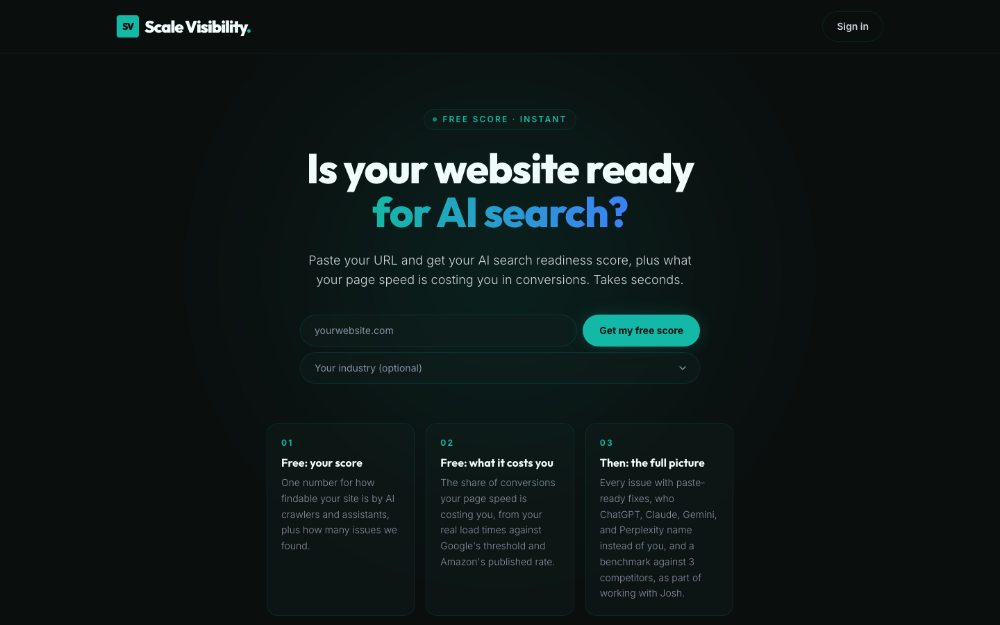
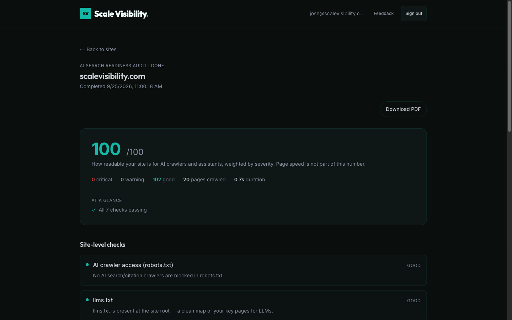
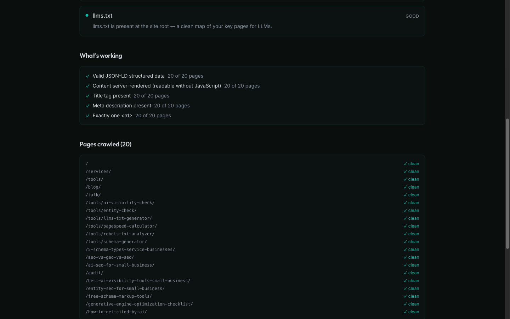
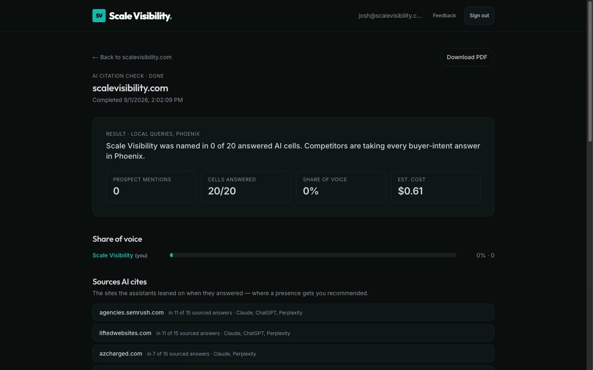
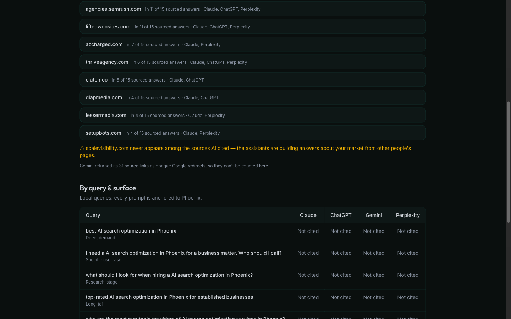
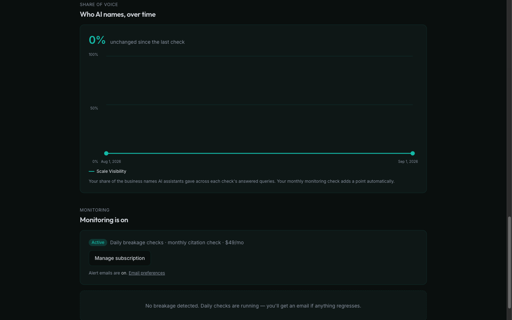

# Scale Visibility — AI search readiness platform

**Live app:** https://app.scalevisibility.com/
**Companion site and free tools:** https://www.scalevisibility.com/
**Built and operated by:** [Joshua Winningham](https://www.joshwinningham.com)

> The source code for Scale Visibility is private. This repository is a public showcase: a product overview, [architecture notes](ARCHITECTURE.md) derived from the real codebase, and [screenshots](screenshots/) of the live product. A code walkthrough is available on request via https://www.joshwinningham.com/#contact.

## What it does

Scale Visibility answers one question for a business website: **is it ready to be found and cited by AI search?** Paste a URL and the app crawls the site, runs a deterministic readiness audit, scores it 0–100, and generates paste-ready fixes. Signed-in workspaces go further: they test whether ChatGPT, Claude, Gemini and Perplexity actually name the business for buyer-intent queries, check whether those assistants state the business's facts correctly, benchmark the site against up to three competitors, and monitor everything on a schedule with alert emails.

Two engines sit underneath:

- **A deterministic audit** (no LLM) that discovers pages from sitemaps and navigation, crawls a capped set through a bounded concurrency pool, and checks AI-crawler access in `robots.txt`, `llms.txt` presence, JSON-LD structured data, client-side-rendering risk, and title/description/H1 hygiene. It also pulls Google PageSpeed Insights lab and field data and translates mobile LCP into an estimated conversion cost.
- **An AI citation module** that sends five buyer-intent queries per industry to each web-search-capable assistant, records the answers and cited sources, matches named entities against the business and its competitors, and computes share of voice with a per-run cost estimate.

## Who uses it

- **Business owners and marketers** who want a free, instant AI-visibility score and a clear list of fixes.
- **Paying workspaces** that need saved reports, citation matrices, accuracy checks, competitor comparisons, PDF exports and ongoing monitoring.
- **Me, as the operator**: the same workspace tooling is what I use to deliver audits and site fixes for clients, and every run reports its LLM cost to Slack so I can watch spend.

## My role

I designed, built, deployed and operate Scale Visibility solo: product scope, the audit and citation engines, the multi-tenant data model and row-level security, Stripe billing, Inngest background workflows, transactional email, PDF export, hosting and day-to-day operations. The app has been in continuous development since late May 2026 (about 225 commits through September 2026).

## Key features

- **Free public score**: anonymous intake with per-IP rate limiting, same-domain result reuse, a live-updating result page, and a one-query "citation teaser" whose inputs are inferred from the homepage by an LLM with a confidence threshold and a form fallback.
- **Workspaces and saved audits** with per-finding rows, generated fixes (corrected `robots.txt`, generated `llms.txt`, Organization and per-page JSON-LD) and audit history.
- **AI citation runs** across Claude, ChatGPT, Gemini (as the AI Overviews proxy) and optionally Perplexity, with share of voice, cited-source aggregation, suggested competitors extracted from transcripts, and a share-of-voice trend per site.
- **AI accuracy check**: fact-shaped questions (hours, address, phone, services, open status) judged by a separate model, with deterministic guards that refuse to call something a mismatch without a verbatim quote.
- **Competitor comparison**: the deterministic audit plus PageSpeed across the site and up to three competitors, side by side.
- **Monitoring**: a daily breakage check (schema gone, `llms.txt` gone, robots regression, score drop) and a monthly citation diff (competitor gained, prospect dropped), with de-duplicated alerts, resolution notices and one-click unsubscribe.
- **Billing**: a one-time audit purchase and a per-site monthly monitoring subscription with a 30-day trial, customer portal, and a signature-verified webhook that drives entitlements and lifecycle email. Self-serve checkout is currently switched off behind a feature flag while the product is sold as part of a direct engagement; the billing code path is intact.
- **PDF export** of audit, comparison, citation and accuracy reports, rendered from the same React components as the web views.
- **Operator safety rails**: a monthly LLM spend ceiling that pauses unattended crons, dead-surface alerts, and a pre-delivery sanity gate that flags any stored run whose conclusion contradicts its own evidence.

## Tech stack

| Layer | Choice |
|---|---|
| Framework | Next.js 16 (App Router, server components, server actions), React 19, TypeScript (strict) |
| Database | PostgreSQL on Supabase with row-level security; Drizzle ORM schema mirror; hand-written SQL migrations |
| Auth | Supabase Auth (email/password with email confirmation, password reset) |
| Background jobs | Inngest (event-driven functions, per-cell steps, two crons) |
| Billing | Stripe Checkout, Billing Portal and webhooks |
| AI providers | Anthropic, OpenAI, Google Gemini and Perplexity REST APIs, all called with native `fetch` |
| Performance data | Google PageSpeed Insights API v5 |
| Email | Resend REST API with hand-built HTML templates |
| PDF | puppeteer-core with a serverless Chromium build |
| UI | Tailwind CSS v4, lucide icons, PWA manifest |
| Hosting | Vercel, with separate dev and production Supabase projects and Stripe modes |

## Why it's built this way

- **Deterministic first, LLM second.** The readiness audit is pure code and runs synchronously inside a server action in well under a minute, so the free score is instant and free to serve. Everything that calls an LLM or a slow third-party API runs in Inngest, where each query-and-surface cell is its own retryable step: one timed-out cell retries alone without re-billing the others.
- **Idempotency is the default.** Every worker claims its row with a compare-and-swap on a status column, partial unique indexes prevent duplicate live subscriptions and duplicate open alerts, and webhook handlers only act on real state transitions. Email and Slack notifications live in their own memoized steps so a notification failure can never fail a completed run.
- **Tenancy enforced in the database.** Row-level security keyed on workspace membership protects every tenant table. The service-role client is confined to background workers, the Stripe webhook, the anonymous front door and token-authorized email endpoints, and each worker re-checks the paid gate itself.
- **Entitlements are computed, not stored.** Whether a site is unlocked is derived live from an operator flag, a paid purchase or a live subscription, so a refund or cancellation re-locks the site with no extra bookkeeping.
- **Cost is a first-class metric.** Each run records its estimated LLM cost from real token and search usage, month-to-date spend is rolled up, and a ceiling stops unattended monitoring runs before they can surprise me.
- **Distrust confident answers.** Entity matching needs proper-noun evidence for single-word names, the accuracy judge must quote the transcript to call a mismatch, teaser inference must clear a confidence bar, and a sanity gate runs before any report is delivered.
- **Security details that matter for a URL-driven product.** A hostname guard blocks private and loopback targets on the public intake and competitor domains, requester IPs are stored only as salted hashes, sign-out is POST-only, unsubscribe uses capability tokens with a confirm step and an RFC 8058 endpoint, and PDFs render under the same access checks as the pages.

## Screenshots

Captured from the live app on my own workspace for scalevisibility.com (the app subdomain is `noindex`, and everything past the free score is behind sign-in).

| | |
|---|---|
|  |  |
|  |  |
|  |  |

## Source and walkthrough

The production repository is private because it contains the audit engine, prompt sets, billing and customer data paths. I am happy to walk through the code, the data model and the Inngest workflows on a call: **https://www.joshwinningham.com/#contact**.
